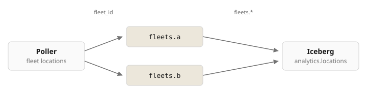

# Fleet telematics to Iceberg

Location pings from two fleets into one PicoMQ stream per fleet, then one Iceberg table.



## Run

Seed appends location pings for fleets `a` and `b`. Each ping lands on `/fleets.{id}` and in the Iceberg table.

```bash
cd examples/connectors/fleet-telematics-iceberg
docker compose up -d --build
./seed.sh
./verify.sh
```

| | Host |
| --- | --- |
| PicoMQ | `http://localhost:9090` |
| DuckDB | `docker compose exec duckdb duckdb -init /opt/duckdb.sql` |

## Queries

Verify the data across PicoMQ and Iceberg.

<table>
<tr><th></th><th>Fleets</th><th>Fleet A</th></tr>
<tr><td>PicoMQ</td><td><pre>docker compose exec pico pico ls --prefix /fleets.</pre></td><td><pre>docker compose exec pico pico read /fleets.a</pre></td></tr>
<tr><td>Iceberg</td><td><pre>SELECT fleet_id, count(*) FROM lake.analytics.locations GROUP BY 1 ORDER BY 1</pre></td><td><pre>SELECT * FROM lake.analytics.locations WHERE fleet_id = 'a' ORDER BY id</pre></td></tr>
</table>

## Resume

Kill the connectors, append a ping, start them again.

```bash
docker compose kill connectors
printf '%s\n' '{"id":"a-resume","fleet_id":"a","vehicle_id":"van-1","lat":51.51,"lon":-0.12,"ts":"2026-09-05T21:00:00Z"}' \
  | docker compose exec -T pico pico append /fleets.a --batch 1
docker compose start connectors
./verify.sh
```

## Sink

`tables` in `iceberg-sink.toml`. Iceberg tables are not created automatically. They have to exist first.

| | `tables` | Iceberg |
| --- | --- | --- |
| Single table | `analytics.locations` | one table, `fleet_id` as a column (this stack) |
| Multi-table | `analytics.locations_{topic_segment[-1]}` | `analytics.locations_a`, `analytics.locations_b` |
