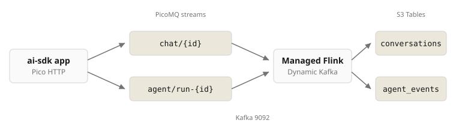

# Flink agents to S3 Tables

The [`agents/ai-sdk`](../../agents/ai-sdk) app writes chat and agent runs to PicoMQ streams under `/examples/agents/ai-sdk/`. Managed Flink discovers those streams with `GET /?prefix=`, consumes them over the Kafka listener, and writes two Iceberg tables in S3 Tables. The app never changes and never sees Iceberg.



| Streams | Table | Columns |
| --- | --- | --- |
| `…/chat/{id}` | `agents.conversations` | `stream, seq, role, content, ts` |
| `…/agent/run-{id}` | `agents.agent_events` | `stream, seq, type, step_index, finish_reason, total_tokens, tools, ts` |

PicoMQ ships an Iceberg sink connector ([`fleet-telematics-iceberg`](../fleet-telematics-iceberg)). This example uses the Kafka protocol into a third-party engine instead.

## Prerequisites

- [`harness/terraform/aws`](../../../harness/terraform/aws) applied.
- The ai-sdk app running against it, see [`agents/ai-sdk/harness.md`](../../agents/ai-sdk/harness.md).
- Maven, Java 17+, DuckDB.

## Run

```bash
cd examples/connectors/flink-agents-s3-tables
export AWS_PROFILE=picomq-support AWS_REGION=us-east-1

mvn -f flink-job -q -DskipTests package
cp terraform/backend.hcl.example terraform/backend.hcl
terraform -chdir=terraform init -backend-config=backend.hcl
terraform -chdir=terraform apply -auto-approve
```

The Flink app reads the harness remote state for VPC, subnets, `kafka.picomq.internal:9092` and the bootstrap token secret. First checkpoint lands about a minute after start.

Use the chat and agent pages at http://localhost:3456, then:

```bash
./verify.sh
```

Logs: `aws logs tail /aws/kinesis-analytics/picomq-agents --follow`.

## Athena

Once per account and region, mount table buckets in the Glue Data Catalog:

```bash
aws glue create-catalog --name s3tablescatalog --catalog-input '{
  "FederatedCatalog": {"Identifier": "arn:aws:s3tables:'$AWS_REGION':'$(aws sts get-caller-identity --query Account --output text)':bucket/*", "ConnectionName": "aws:s3tables"},
  "CreateDatabaseDefaultPermissions": [{"Principal": {"DataLakePrincipalIdentifier": "IAM_ALLOWED_PRINCIPALS"}, "Permissions": ["ALL"]}],
  "CreateTableDefaultPermissions": [{"Principal": {"DataLakePrincipalIdentifier": "IAM_ALLOWED_PRINCIPALS"}, "Permissions": ["ALL"]}],
  "AllowFullTableExternalDataAccess": "True"
}'
```

Then in Athena:

```sql
SELECT * FROM "s3tablescatalog/<table bucket name>"."agents"."conversations" ORDER BY stream, seq
```

## Tear down

```bash
terraform -chdir=terraform destroy -auto-approve
```
