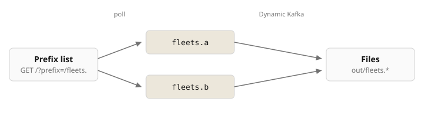

# Flink Dynamic Kafka, prefix list

Location pings from fleets as PicoMQ streams. Flink discovers topics with `GET /?prefix=/fleets.`, consumes them over Kafka, and writes one file bucket per topic.



## Run

Seed appends location pings for fleets `a` and `b`. Each ping lands on `/fleets.{id}` and in `./out/fleets.{id}/`.

```bash
cd examples/connectors/flink-dynamic-kafka
docker compose up -d --build
./seed.sh
./verify.sh a b
```

| | Host |
| --- | --- |
| PicoMQ | `http://localhost:9090` |
| Files | `./out/fleets.<id>/` |

## Add a fleet

Create `/fleets.c` while Flink is running. The next prefix-list poll adds topic `fleets.c`.

```bash
./add.sh
./verify.sh a b c
```

## Remove a fleet

Delete `/fleets.a`. The next poll drops that topic. `/fleets.b` keeps receiving.

```bash
./remove.sh
./verify.sh b c
```

## Sink

`FileSink` under `./out`, bucketed by Kafka topic. Checkpoints every 2s so files show up without a shutdown.
