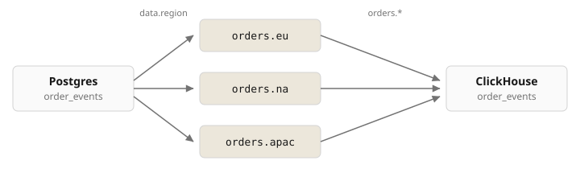

# Postgres CDC to ClickHouse

CDC from Postgres `order_events` into one PicoMQ stream per `region`, then one ClickHouse table.



## Run

Seed inserts a series of `order_events` rows for `eu`, `na`, and `apac`. Each row lands on `/orders.{region}` and in the ClickHouse table.

```bash
cd examples/connectors/postgres-cdc-clickhouse
docker compose up -d
./seed.sh    # insert order events by region
./verify.sh  # check streams and counts
```

| | Host | Auth |
| --- | --- | --- |
| Postgres | `http://localhost:8082` | `pico` / `pico` |
| PicoMQ | `http://localhost:9090` | |
| ClickHouse | `http://localhost:8123/play` | `pico` / `pico` |

## Queries

Verify the data across Postgres, PicoMQ, and ClickHouse.

<table>
<tr><th></th><th>Regions</th><th>EU</th></tr>
<tr><td>Postgres</td><td><pre>SELECT region, count(*) FROM order_events GROUP BY region ORDER BY region</pre></td><td><pre>SELECT * FROM order_events WHERE region = 'eu' ORDER BY id</pre></td></tr>
<tr><td>ClickHouse</td><td><pre>SELECT region, uniqExact(id) FROM order_events GROUP BY region ORDER BY region</pre></td><td><pre>SELECT * FROM order_events WHERE region = 'eu' ORDER BY id, created_at</pre></td></tr>
<tr><td>PicoMQ</td><td><pre>docker compose exec pico pico ls --prefix /orders.</pre></td><td><pre>docker compose exec pico pico read /orders.eu</pre></td></tr>
</table>

## Resume

Kill the connectors, insert a row, start them again.

```bash
docker compose kill connectors
docker compose exec postgres psql -U pico -d example -c \
  "INSERT INTO order_events (order_id, region, merchant_id, \"type\", payload)
   VALUES ('ord-eu-resume', 'eu', 'lemongrass', 'placed', '{}'::jsonb);"
docker compose start connectors
./verify.sh
```

## Sink

`table` in `clickhouse-sink.toml`. ClickHouse tables are not created automatically. They have to exist first.

| | `table` | ClickHouse |
| --- | --- | --- |
| Single table | `order_events` | one table, `region` as a column (this stack) |
| Multi-table | `order_events_{topic_segment[-1]}` | `order_events_eu`, `order_events_na`, `order_events_apac` |
