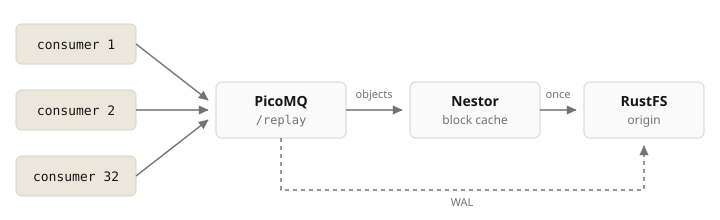

# Replay fan-out through Nestor

[Nestor](https://github.com/picomq/nestor) as the S3 endpoint for PicoMQ. 32 consumers replay one stream, the origin serves each block once.



## Run

```bash
cd examples/storage/nestor-fanout
docker compose up -d
./seed.sh    # 32 MiB into /replay
./verify.sh  # 32 parallel replays, restart, one more
```

| | Host | Auth |
| --- | --- | --- |
| PicoMQ | `http://localhost:9090` | |
| Nestor S3 | `http://localhost:9000` | `picomq` / `picomqpicomq` |
| Nestor metrics | `http://localhost:9100/metrics` | |
| RustFS | `http://localhost:19000` | `picomq` / `picomqpicomq` |

First pass: 1 GiB delivered, about 25 MiB fetched from RustFS. Second pass after `docker compose restart pico`: PicoMQ's caches are empty, Nestor's are not.

## Config

| Where | Setting | Why |
| --- | --- | --- |
| `compose.yml` | `PICO_STORAGE=…endpoint=http://nestor:9000` | Objects through Nestor |
| `compose.yml` | `PICO_WAL=…endpoint=http://rustfs:9000` | WAL is write once, skips the cache |
| `compose.yml` | `--wal-cache-size 8388608 --block-cache-size 1048576` | Small in-process caches so replays leave the node. Defaults are 200 MiB and 100 MiB |
| `nestor.toml` | `consistency = { mode = "immutable" }` | PicoMQ never reuses an object key |
| `nestor.toml` | `readahead = 0` | PicoMQ prefetches for itself |

## Bigger

```bash
RECORDS=4096 ./seed.sh     # 256 MiB, spills to Nestor's disk tier
READERS=128 ./verify.sh
```
